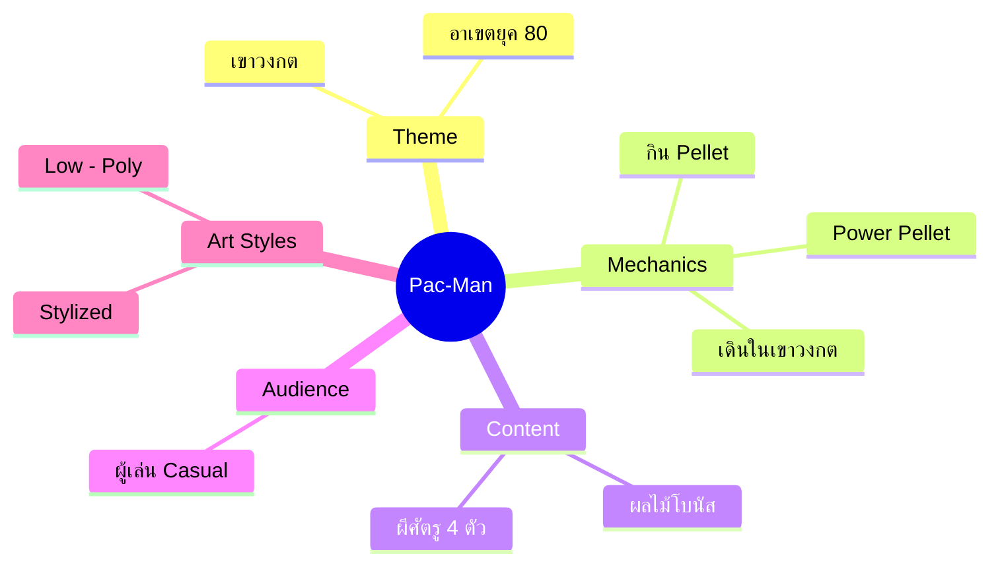
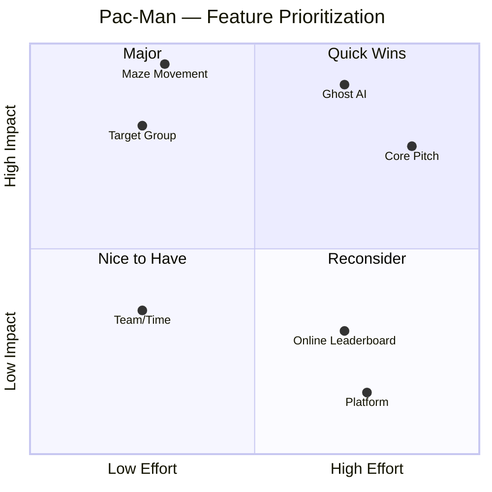
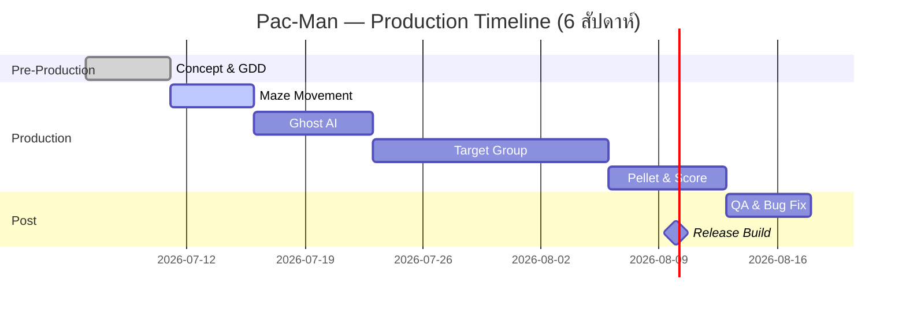

```mermaid
mindmap
    root((Pac-Man))
        Theme
            เขาวงกต
            อาเขตยุค 80
        Mechanics
            เดินในเขาวงกต
            กิน Pellet
            Power Pellet
        Content
            ผีศัตรู 4 ตัว
            ผลไม้โบนัส
        Audience
            ผู้เล่น Casual
        Art Styles
            Stylized
            Low - Poly
```

```mermaid
quadrantChart
    title Pac-Man — Feature Prioritization
    x-axis Low Effort --> High Effort
    y-axis Low Impact --> High Impact
    quadrant-1 Quick Wins
    quadrant-2 Major
    quadrant-3 Nice to Have
    quadrant-4 Reconsider

    Maze Movement: [0.3, 0.95]
    Target Group: [0.25, 0.8]

    Ghost AI: [0.7, 0.9]
    Core Pitch: [0.85, 0.75]
    

    Online Leaderboard: [0.7, 0.3]
    Platform: [0.75, 0.15]

    Team/Time: [0.25, 0.35]
```

```mermaid
gantt
    title Pac-Man — Production Timeline (6 สัปดาห์)
    dateFormat YYYY-MM-DD
    section Pre-Production
    Concept & GDD           :done, c1, 2026-07-06, 5d
    section Production
    Maze Movement           :active, p1, after c1, 5d
    Ghost AI                : p2, after p1, 7d
    Target Group            : p3, after p2, 14d
    Pellet & Score          : p4, after p3, 7d
    section Post
    QA & Bug Fix            : q5, after p4, 5d
    Release Build           :milestone, m1, after q1, 0d
```
